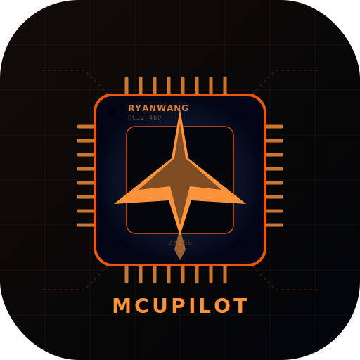
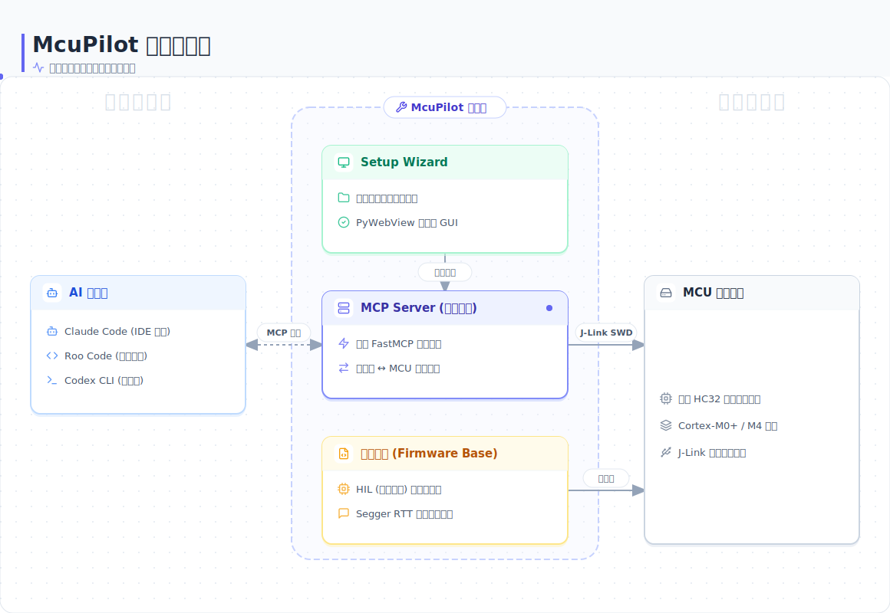

# McuPilot

<p align="center">
  
</p>

<p align="center">
  
  
  
  
  <br/>
  
  
  
  
</p>

**McuPilot** 是面向 Cortex-M 的运行时 AI 协同工具链。通过 [MCP 协议](https://modelcontextprotocol.io/) 为 AI 提供编译、烧录、热修参数、高速数据采集、硬件在环等全套单片机操作能力。专为高速控制场景设计（如 30μs 响应链路），依托 J-Link SWD 总线，无需 UART、无需停机。

- **白名单限定工作域，省 token** — 编译期用 `HIL_WHITELIST` 标记可交互变量，AI 只在这组变量范围内读写，不扫全量 `.map`，避免 token 浪费。
- **热重载，不重烧** — AI 通过 AHB-AP 总线单周期读写 SRAM，50MHz 下约 20ns 完成一次参数覆写，无需复位即可生效。
- **RTT 代替 UART 传数据** — 环形缓冲内存拷贝即可上传，不占用通信外设，30μs 中断链路中保障实时时序不受影响。

---

## 目录

- [快速开始](#快速开始)
- [亮点](#亮点)
- [架构](#架构)
- [软硬件要求](#软硬件要求)
- [项目结构](#项目结构)
- [许可](#许可)

## 亮点

- **双入口启动** — Release 包双击即用，或 `python run_setup.py` 源码运行
- **环境自检** — 启动时自动检测系统 Python 和依赖库，缺什么装什么
- **一键部署** — 自动注入 HIL/RTT 到 Keil 工程、编译、解析、注册 MCP
- **AI 协同调试** — 通过自然语言操控单片机，支持热注入不停机修改参数
- **聚焦国产 MCU** — 华大 HC32 系列 (M0~M4)

## 架构

<p align="center">
  
</p>

三类技能以 MCP Tool 的形式暴露给 AI：

| 类别 | 功能 |
|------|------|
| **查阅 (Knowledge RAG)** | 引脚图、SDK 参考手册 |
| **动作 (Actions)** | 初始化工程配置、编译烧录固件、硬复位、HIL 参数注入 |
| **感知 (Sensors)** | RTT 日志捕获、双向 RTT 通信、传感器快照分析、实时变量读取 |

## 软硬件要求

### 硬件
- **MCU**: 华大 HC32 系列（已实测 HC32F460、HC32L021）
- **调试器**: SEGGER J-Link（任意型号）
- **目标板**: 华大单片机开发板或自研 PCB

### 软件
- Python 3.10+
- [SEGGER J-Link Software](https://www.segger.com/downloads/jlink/)（v7.x+）
- [Keil MDK](https://www.keil.com/download/product/) v5（用于编译和烧录）
- 支持 MCP Tool 的 AI 助手（Claude Code、Roo Code 等）

## 快速开始

**方式一：下载 Release 包（推荐）**

从 [Releases](https://github.com/RyanWang-CN/mcupilot/releases) 下载 `McuPilot.zip`，解压双击 `McuPilot.exe`，自动检测环境并进入配置向导。

**方式二：源码运行**

```bash
git clone https://github.com/RyanWang-CN/mcupilot.git
cd mcupilot
setup.bat          # Windows 一键安装依赖
python run_setup.py  # 启动配置向导
```

## 安装（仅方式二需要）

```bash
python -m venv venv
.\venv\Scripts\activate
pip install -r requirements.txt
```

Windows 用户也可直接双击 `setup.bat` 一键完成上述操作。

## 配置

### 1. 环境变量（可选）
如果用 LlamaCloud 的 PDF 解析功能，复制 `.env.example` 为 `.env` 并填入 API Key：
```bash
copy .env.example .env
```

### 2. 工程初始化
进入你的 Keil 工程目录，依次执行：

```bash
# 自动嗅探工程结构，生成配置文件
python -m core.auto_config_builder

# 扫描 .map/.axf 生成 HIL 物理内存字典
python -m core.hil_parser
```

## 使用流程

> 完整指南见 [docs/USER_GUIDE.md](docs/USER_GUIDE.md)

### 启动 MCP Server
```bash
python mcp_server.py
```

### MCP 工具一览

| 工具 | 说明 |
|------|------|
| `init_project_config` | 自动嗅探工程结构，生成 YAML 配置 |
| `update_hil_dictionary` | 扫描 .map/.axf，更新物理内存寻址字典 |
| `build_project` | 编译 Keil MDK 工程 |
| `flash_project` | 烧录 Hex 固件到单片机 |
| `hard_reset_mcu` | 物理硬复位单片机 |
| `rtt_print` | 抓取 J-Link RTT 输出日志 |
| `rtt_ask` | 向单片机下发 RTT 指令并监听回显 |
| `take_sensor_snapshot` | 阻塞式抓取传感器二进制数据帧，离线解算统计特征 |
| `inject_hil_parameters` | 向单片机物理内存热注入 HIL 测试参数 |
| `read_hil_variable` | 读取单片机中全局变量的当前值 |
| `check_mcu_status` | 检查单片机 CPU 运行状态（Running/Halted） |
| `get_hardware_probe_info` | 获取 J-Link 探针信息（含目标板电压） |
| `scan_connected_probes` | 扫描 USB 接口上所有 J-Link 仿真器 |
| `check_rtt_health` | 探测单片机内存中 RTT 通道分配情况 |

### 调试工具

| 工具 | 说明 |
|------|------|
| `debug_run` | 恢复单片机运行 |
| `debug_halt` | 暂停单片机并返回 PC 指针 |
| `debug_step` | 单步执行一条机器指令 |
| `debug_set_breakpoint` | 设置硬件断点（支持地址或符号名） |
| `debug_clear_breakpoint` | 移除硬件断点 |
| `debug_clear_all_breakpoints` | 一键清除所有硬件断点 |
| `debug_run_to_breakpoint` | 设断点后恢复运行，阻塞等待命中后自动清理 |

## HIL 热注入

HIL 子系统实现了**不停止单片机运行**的参数热替换机制，采用三阶段原子化注入策略：

1. **克隆 (Clone)** — 读取当前激活的配置块，全量拷贝到备用缓冲区
2. **差分 (Delta)** — 只写入改动的参数
3. **提交 (Commit)** — 通过协议号握手原子切换版本

### 固件集成

将 `HIL/` 和 `RTT/` 目录复制到你的 Keil 工程，添加以下文件到工程：

- `hil_inject.c` / `hil_inject.h` — HIL 注入底座（用户自研）
- `hil_config_user.h` — 用户配置层，定义你的业务结构体
- `SEGGER_RTT.c` / `SEGGER_RTT.h` / `SEGGER_RTT_printf.c` / `SEGGER_RTT_Conf.h` — RTT 通信协议栈（感谢 SEGGER Microcontroller GmbH）

集成方法参见 `HIL/example_main.c`，核心三步：

```c
// 1. 初始化
HIL_Inject_Init(&hil_cfg);

// 2. 主循环轮询（5-10ms 间隔）
HIL_Inject_Task();

// 3. 业务代码零开销读取当前参数
volatile Radar_Params_t *params = &HIL_GET_ACTIVE_CFG()->radar;
```

## 项目结构

```
├── mcp_server.py              # MCP 服务入口
├── core/                      # 基建引擎层
│   ├── mcu_mem_ctrl.py        # J-Link 物理内存驱动
│   ├── hil_parser.py          # DWARF/.map 解析器（展平嵌套结构体）
│   ├── keil_parser.py         # Keil 工程 XML 解析器
│   ├── auto_config_builder.py # 自动配置构建
│   └── doc_parser.py          # PDF 文档清洗（LlamaCloud）
├── skills/
│   ├── build/                 # 编译、烧录、复位
│   ├── injection/             # HIL 参数注入
│   ├── perception/            # RTT 监控、双向通信
│   └── rag/                   # 知识检索（预留）
├── HIL/                       # MCU 侧 HIL 注入底座（固件代码）
│   ├── hil_inject.c           #   注入逻辑实现
│   ├── hil_inject.h           #   注入协议头文件
│   ├── hil_config_user.h      #   用户配置层（定义业务结构体）
│   └── example_main.c         #   集成示例
├── RTT/                       # SEGGER RTT 协议栈（固件代码，感谢 SEGGER）
│   ├── SEGGER_RTT.c
│   ├── SEGGER_RTT.h
│   ├── SEGGER_RTT_printf.c
│   └── SEGGER_RTT_Conf.h
├── tests/                     # 单元测试 (pytest)
│   ├── conftest.py
│   ├── elf_builder.py
│   ├── test_hil_parser.py
│   ├── test_keil_parser.py
│   ├── test_mcu_mem_ctrl.py
│   └── samples/
├── .github/workflows/         # CI (GitHub Actions)
│   └── test.yml
├── knowledge_base/            # MCU 参考手册（SVD 文件）
├── docs/                      # 文档
├── build_kb.py                # 知识库增量构建器
├── setup.bat                  # Windows 一键安装脚本 (CMD)
├── setup.ps1                  # Windows 一键安装脚本 (PowerShell)
├── requirements.txt           # Python 依赖清单
└── LICENSE
```

## 许可

[MIT](LICENSE)
